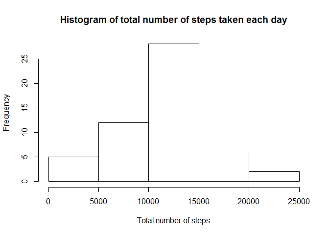
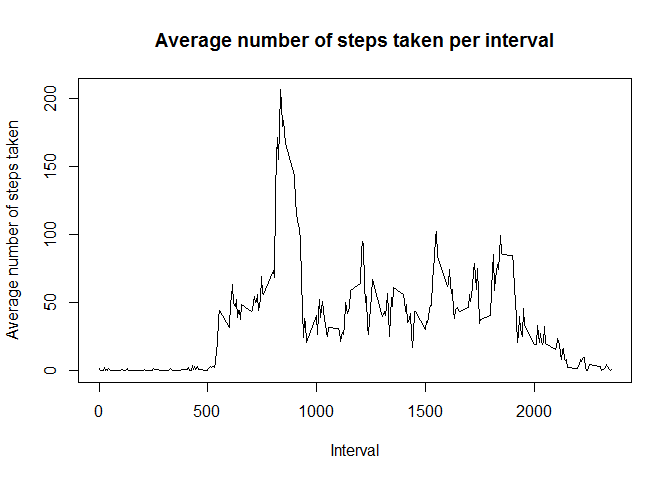
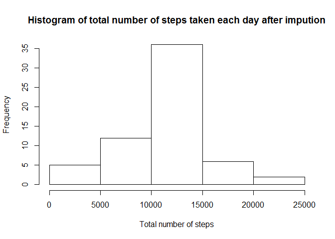
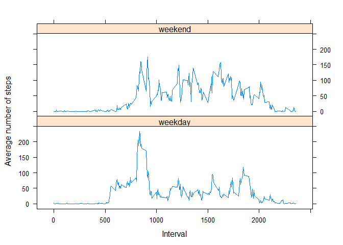

# Peer assessment 1

This report investigates data about personal movement using activity monitoring devices.

## Loading and preprocessing the data

```r
# Read data
df <- read.csv("activity.csv")

# Acquire some general idea of the data
head(df)
```

```
##   steps       date interval
## 1    NA 2012-10-01        0
## 2    NA 2012-10-01        5
## 3    NA 2012-10-01       10
## 4    NA 2012-10-01       15
## 5    NA 2012-10-01       20
## 6    NA 2012-10-01       25
```

```r
str(df)
```

```
## 'data.frame':	17568 obs. of  3 variables:
##  $ steps   : int  NA NA NA NA NA NA NA NA NA NA ...
##  $ date    : Factor w/ 61 levels "2012-10-01","2012-10-02",..: 1 1 1 1 1 1 1 1 1 1 ...
##  $ interval: int  0 5 10 15 20 25 30 35 40 45 ...
```

```r
summary(df)
```

```
##      steps                date          interval     
##  Min.   :  0.00   2012-10-01:  288   Min.   :   0.0  
##  1st Qu.:  0.00   2012-10-02:  288   1st Qu.: 588.8  
##  Median :  0.00   2012-10-03:  288   Median :1177.5  
##  Mean   : 37.38   2012-10-04:  288   Mean   :1177.5  
##  3rd Qu.: 12.00   2012-10-05:  288   3rd Qu.:1766.2  
##  Max.   :806.00   2012-10-06:  288   Max.   :2355.0  
##  NA's   :2304     (Other)   :15840
```
Further data processing/transforming for analysis is not yet necessary.

## What is mean total number of steps taken per day?

```r
# Calculate the total number of steps taken per day
totalday <- aggregate(steps ~ date, df, sum)

# Make a histogram of the total number of steps taken each day
hist(totalday$steps,
  main = "Histogram of total number of steps taken each day",
  xlab = "Total number of steps",
	ylab = "Frequency")
```

 

```r
# Calculate the mean and median of total number of steps taken per day
mean(totalday$steps)
```

```
## [1] 10766.19
```

```r
median(totalday$steps)
```

```
## [1] 10765
```
The mean number of steps is 10766.19 and the median is 10765.

## What is the average daily activity pattern?

```r
# Calculate the average number of steps taken per interval across all days
meaninterval <- aggregate(steps ~ interval, df, mean)

# Make a time series plot of the average number of steps per interval
plot(meaninterval$interval, meaninterval$steps, 
  type = "l",
  main = "Average number of steps taken per interval",
	xlab = "Interval",
	ylab = "Average number of steps taken")
```

 

```r
# Find the 5 minute interval that contains the maximum average number of steps
meaninterval[meaninterval$steps == max(meaninterval$steps), ]
```

```
##     interval    steps
## 104      835 206.1698
```
Interval 835 contains the maximum average number of steps.

## Imputing missing values

```r
# Calculate the total number of missing values in the dataset
colSums(is.na(df))
```

```
##    steps     date interval 
##     2304        0        0
```
There are 2304 missing values in the steps column and none in the others. To fill in the missing values, I would suggest using either the means or medians for that interval across the other days. First compare the summary for these means and medians.

```r
# Calculate the average and median number of steps taken per interval across all days
meaninterval <- aggregate(steps ~ interval, df, mean)
medianinterval <- aggregate(steps ~ interval, df, median)

# Compare the average and median number of steps taken per interval across all days
summary(medianinterval)
```

```
##     interval          steps       
##  Min.   :   0.0   Min.   : 0.000  
##  1st Qu.: 588.8   1st Qu.: 0.000  
##  Median :1177.5   Median : 0.000  
##  Mean   :1177.5   Mean   : 3.962  
##  3rd Qu.:1766.2   3rd Qu.: 0.000  
##  Max.   :2355.0   Max.   :60.000
```

```r
summary(meaninterval)
```

```
##     interval          steps        
##  Min.   :   0.0   Min.   :  0.000  
##  1st Qu.: 588.8   1st Qu.:  2.486  
##  Median :1177.5   Median : 34.113  
##  Mean   :1177.5   Mean   : 37.383  
##  3rd Qu.:1766.2   3rd Qu.: 52.835  
##  Max.   :2355.0   Max.   :206.170
```
Comparing the summary of the calculated means and medians, using means to fill in missing values is my preference. The medians show values between 0 and 60, with a mean median of about 4 and a median median of 0. The means show values between 0 and 206, with a mean mean of about 37 and a median mean of 34. So, in my opinion, the calculated means reflect the measurements better.

```r
# Create a new dataset that is equal to the original, but with missing values filled in
newdf <- df
for (i in 1:nrow(newdf)){
  if (is.na(df$steps[i])){
		newdf$steps[i] <- meaninterval$steps[which(newdf$interval[i] == meaninterval$interval)]
	}
}

# Make a histogram of total number of steps taken each day
newtotalday <- aggregate(steps ~ date, newdf, sum)
hist(newtotalday$steps,
	main = "Histogram of total number of steps taken each day after impution",
	xlab = "Total number of steps",
	ylab = "Frequency")
```

 

```r
# Calculate the mean and median total number of steps
newtotalday <- aggregate(steps ~ date, newdf, sum)
mean(newtotalday$steps)
```

```
## [1] 10766.19
```

```r
median(newtotalday$steps)
```

```
## [1] 10766.19
```
The mean steps per day is identical to the first estimates, the median is slightly higher. When simply looking at the new mean and median, there is only a very small impact when missing data is imputed. The filled in values are only estimates, so if any other operations are done with this new data, one must be cautious, as conclusions might not correctly reflect the collected data.

## Are there differences in activity patterns between weekdays and weekends?
For this analysis the original dataset will be used, as the calculated means were acquired from a mix of week and weekend days. 

```r
# Create a new factor variable in the dataset (weekday and weekend)
df$day <- weekdays(as.Date(df$date))
df$day <- ifelse(df$day %in% c("Saturday", "Sunday"), "weekend", "weekday")

# Make a panel time series plot that compares weekday and weekend
daymean <- aggregate(steps ~ interval + day, df, mean)

library(lattice)
xyplot(steps ~ interval | day, daymean, 
  layout = c(1, 2), 
	type = "l", 
	xlab = "Interval", 
	ylab = "Average number of steps") 
```

 

Using the eyeball test, the plots show that there is some difference between activity in the weekend and during weekdays. The difference can be seen mainly at the start of the day, on weekdays the average is higher early in the day. The rest of the day is quite similar.
